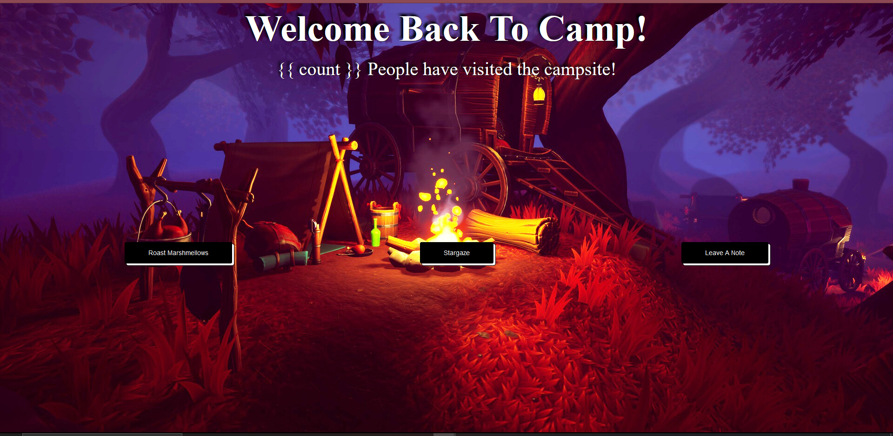

# THIS IS MY ARTIST STATEMENT - MY "WHY"

## What's The Moonlit Campsite?

For this lab I wanted to craft something that was comfy.  My last two vibes dealt with a hard, sci-fi technology aesthetic, and with all the past few weeks' lectures being about geographical AR, I wanted to revisit a more natural/

A screenshot of its early progress.  Originally it was going to have a notes button, but I decided I wanted to focus on the two other things instead.

As an artist first, working with web apps and networking was difficult.  And though simple, as with my other projects, I try to make them more with art.  Moonlit Campsite promotes togetherness by reflecting data as passing things--online, there will be moments where we're never truly togeher in real time, but the mark we make exists forever and can be felt forever.  

I know Moonlit Campsite won't be popular outside of class, but that's my aim-- it's a niche web app, and whoever stumbles upon it can leave their mark--whether that be smores or star gazing--for someone else days, months, or years in the future to discover.  It's that strange exciting nature of internet data archiving I wanted to generate in web app.  

We've never alone on the internet, even if interactions span years a part.

